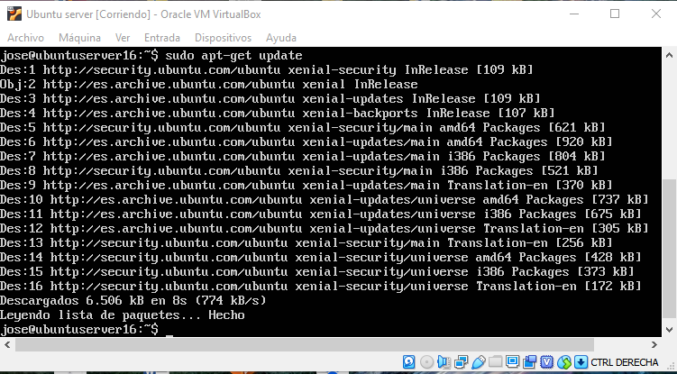
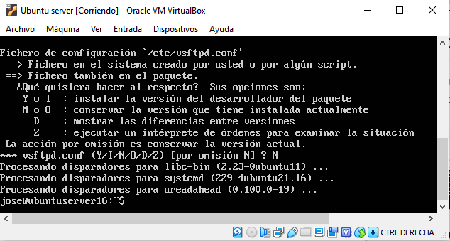
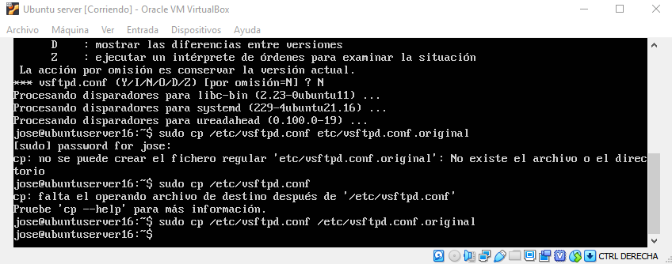
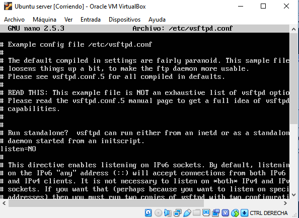
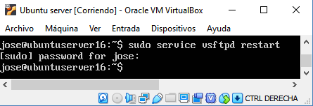
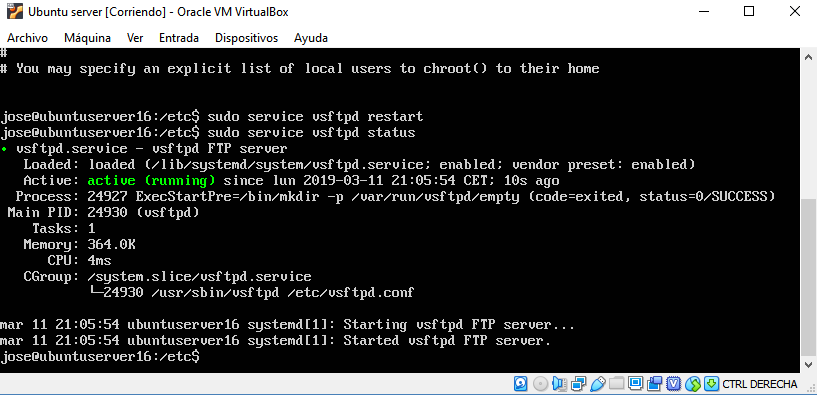
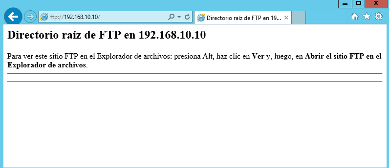
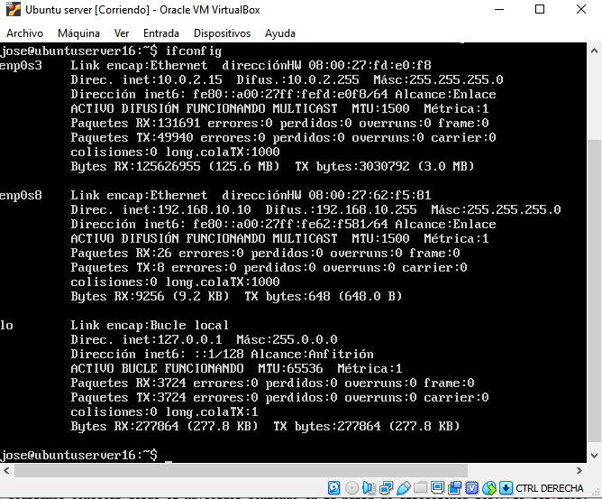

# Instalación y configuración de VSFTPD con usuarios aislados del sistema

## Actualización
Antes de comenzar nada se debe hacer una actualización del servidor para que no haya ningún error de 
compatibilidad. Para ello utilizaré los comandos ***`sudo apt-get update`*** y ***`sudo apt-get upgrade`*** .

## Instalación
Una vez he que hayamos actualizado el servidor procederemos a la instalación, para ello nos ayudaremos del comando 
***`sudo apt-get install vsftpd`*** .

Como reseña y antes de seguir avanzando es interesante conocer los comandos para iniciar, detener y reiniciar el 
servicio:
* Iniciar: ***`sudo service vsftpd start`***
* Detener: ***`sudo service vsftpd stop`***
* Reiniciar: ***`sudo service vsftpd restart`***

Ojo: ***service*** o ***systemctl*** según la versión del sistema operativo.

## Copia de seguridad
Para poder continuar con total tranquilidad, es recomendable realizar una copia de seguridad del archivo ***vsftpd.conf*** 
que posteriormente se configurará por si se hace mal la práctica. Para ello se utilizará el comando ***`sudo cp /etc/vsftpd.conf /etc/vsftpd.conf.original`*** .
Aquí le estamos diciendo que se haga una copia en ***/etc/vsftpd.conf.original*** .

## Configuración de VSFTPD
Una vez vsftpd está instalado, se puede comenzar a configurar el servidor FTP. Este servicio por defecto tiene la sesión
anónima desactivada, además, viene sin los usuarios enjaulados, lo que significará que cualquier usuario que
inicie sesión se podrá mover por todos los directorios. Así que lo primero que haremos será activar el chroot o jaula 
de los usuarios, para ello utilizaremos ***`sudo /etc/vsftpd.conf`***

Una vez hemos realizado estos cambios, podemos guardar y salir. Seguidamente reiniciamos el servicio de vsftpd: 
***`sudo service vsftpd restart`*** . 

Si no nos dice nada el sistema es que se ha restablecido correctamente. No obstante
es interesante comprobar el estado del servidor para verificar que el servicio esté funcionando correctamente. Para ello
podemos utilizar el comando ***`sudo service vsftpd status`***

Con esto ya nos podríamos conectar desde el navegador poniendo en la barra de direcciones ftp://IP_servidor 

Para obtener la Ip podemos ayudarnos de ***`ifconfig`*** .

# Usuarios

## Creación de usuarios

 