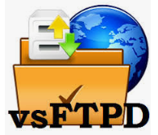
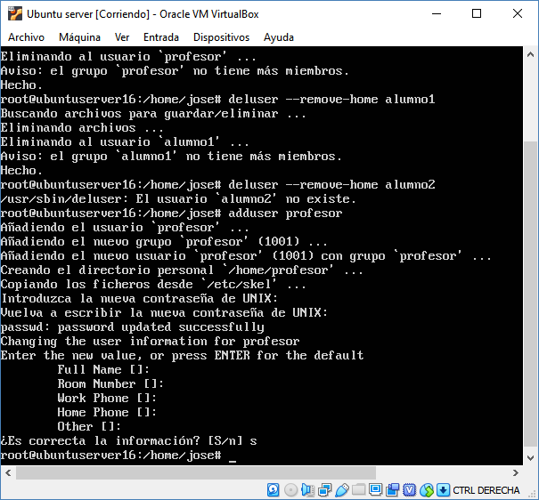

# Instalación y configuración de VSFTPD con usuarios aislados del sistema

## Introducción
Una de las grandes ventajas de Ubuntu, y en general de cualquier distribución Linux, es que puedes montar de forma muy 
sencilla diferentes servicios, y entre los servicios mas interesantes que podemos disfrutar en nuestra máquinas es un 
servicio ftp.

En el mundo de la informática en general, un servidor es un dispositivo que provee servicios a otros equipos, que se 
conocen como clientes. Y ¿qué es un servicio? Pues un servicio o demonio, es una aplicación o programa que se ejecuta 
en segundo plano, y cuya función mas habitual es la de ofrecer servicios a otros programas.

En este repositorio, veremos como instalar de forma muy sencilla un servicio FTP mediante VSFTPD. Decir que FTP es un protocolo
de transferencia de archivos y se pudede decir que es el más común.

## VSFTPD
He de decir primero, que el servidor vsftpd, se distribuye bajo licencia libre GNU GPL y puede descargarse de la 
página oficial de [vsftpd](https://security.appspot.com/vsftpd.html) .

Vsftpd (Very Secure FTP Daemon), es un servicio FTP que permite implementar servicios de archivos mediante protocolo FTP,
caracterizándose principalmente porque se trata de un sistema muy seguro, a la vez que muy sencillo de configurar. 
[Ver más información](https://en.wikipedia.org/wiki/Vsftpd)

## Actualización
Antes de comenzar nada se debe hacer una actualización del servidor para que no haya ningún error de 
compatibilidad. Para ello utilizaré los comandos ***`sudo apt-get update`*** , e incluso a veces se aconseja realizar 
también una mejora del sistema utilizando ***`sudo apt-get upgrade`*** .

## Instalación
Una vez he que hayamos actualizado el servidor procederemos a la instalación, para ello nos ayudaremos del comando 
***`sudo apt-get install vsftpd`*** .

Como reseña y antes de seguir avanzando es interesante conocer los comandos para iniciar, detener y reiniciar el 
servicio:
* Iniciar: ***`sudo service vsftpd start`***
* Detener: ***`sudo service vsftpd stop`***
* Reiniciar: ***`sudo service vsftpd restart`***

Ojo: ***service*** o ***systemctl*** según la versión del sistema operativo.

## Copia de seguridad
Para poder continuar con total tranquilidad, es recomendable realizar una copia de seguridad del archivo ***vsftpd.conf*** 
que posteriormente se configurará por si se hace mal la práctica. Para ello se utilizará el comando ***`sudo cp /etc/vsftpd.conf /etc/vsftpd.conf.original`*** .
Aquí le estamos diciendo que se haga una copia en ***/etc/vsftpd.conf.original*** .

## Configuración de VSFTPD
Una vez vsftpd está instalado, se puede comenzar a configurar el servidor FTP. Este servicio por defecto tiene la sesión
anónima desactivada, además, viene sin los usuarios enjaulados, lo que significará que cualquier usuario que
inicie sesión se podrá mover por todos los directorios. Así que lo primero que haremos será activar el chroot o jaula 
de los usuarios, para ello utilizaremos ***`sudo /etc/vsftpd.conf`***

Una vez hemos realizado estos cambios, podemos guardar y salir. Seguidamente reiniciamos el servicio de vsftpd: 
***`sudo service vsftpd restart`*** . 

Si no nos dice nada el sistema es que se ha restablecido correctamente. No obstante
es interesante comprobar el estado del servidor para verificar que el servicio esté funcionando correctamente. Para ello
podemos utilizar el comando ***`sudo service vsftpd status`***

Con esto ya nos podríamos conectar desde el navegador poniendo en la barra de direcciones ftp://IP_servidor 

Para obtener la Ip podemos ayudarnos de ***`ifconfig`*** .

# Usuarios/Enjaular usuarios
Cuando se crea un servidor FTP de Ubuntu, habrá que tener en cuenta que hay que crear/seleccionar unos usuarios con sus 
correspondientes configuraciones para que puedan tener el acceso FTP, por lo tanto hay que crearlos. 

Habrá que tener en cuenta que si los usuarios locales del servidor se conectan remotamente mediante un cliente ftp al 
servicio ftp podrán acceder a sus carpetas personales y además al resto del sistema de archivos. Esto es peligroso y 
un fallo de seguridad.
Vamos a explicar, como limitarlos a su carpeta /home/usuario. Este proceso se le llama chroot (enjaular).

## Creación de usuarios
Para la creación de un nuevo usuario bastará con utilizar el comando ***`sudo adduser nombre_usuario`*** . Concretamente
en este tutorial utilizaré como ejemplo la creación de un usuario profesor, alumno1 y alumno2. Nuevamente en este apartado
es interesante destacar la posibilidad de borrar usuarios ***`sudo deluser nombre_usuario`*** o de borrarlos junto con sus archivos.
***`sudo deluser --remove-home nombre_usuaruio`*** o ***`sudo userdel nombreusuario`*** .

En la siguiente imagen se puede observar la ejecución de los comandos anteriores, no obstante como ya se ha comentado al inicio
de este apartado se crearán de idéntica forma que en la imagen los usuarios alumno1 y alumno2.

## Creación de directorios
, ingresa una contraseña para el usuario y completa todos los demás detalles. Lo ideal es 
que el FTP se restrinja a un directorio específico por motivos de seguridad. Vsftpd usa jaulas chroot para lograr esto. 
Con chroot habilitado, un usuario local está restringido a su directorio de inicio (por defecto). Sin embargo, es posible
que debido a la seguridad de vsftpd, un usuario no pueda escribir en el directorio. No eliminaremos los privilegios de 
escritura de la carpeta de inicio; en su lugar, crearemos un directorio ftp que actuará como chroot junto con un 
directorio de archivos modificables que será responsable de mantener los archivos pertinentes. Usa el siguiente comando 
para crear la carpeta FTP:
Una vez creado un usuario hay que crear su directorio al cual corresponderá. En el caso de esta práctica crearé 4 directorios,
uno para cada usuario y otro para admin que explicaremos más tarde. Meteré los 2 directorios de alumnos dentro del directorio
de profesor y el de profesor dentro del de admin. 

Para ello utilizaré el comando ***`sudo mkdir /home/profesor/ftp`***

 