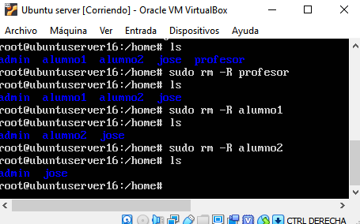
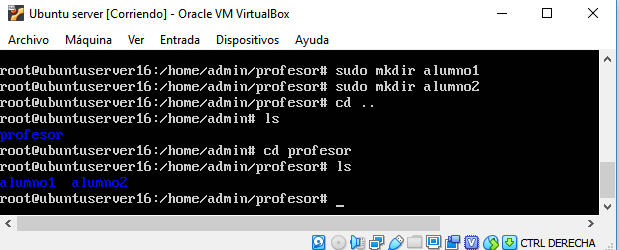
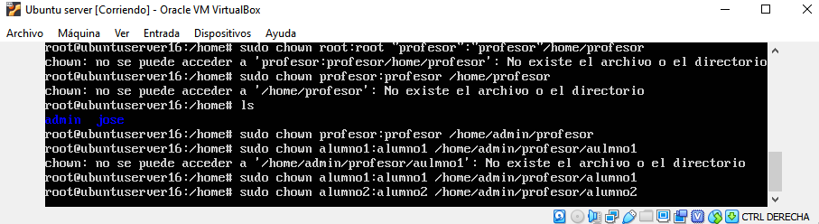
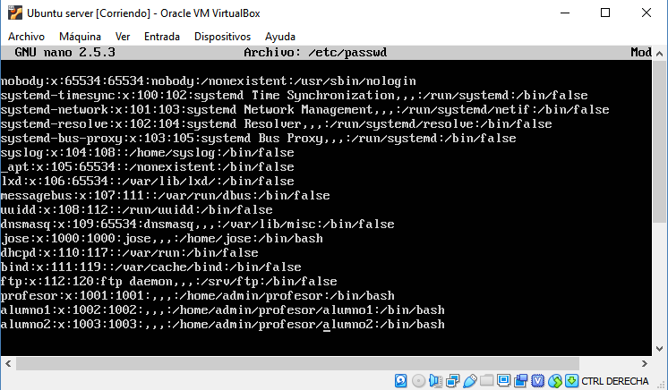
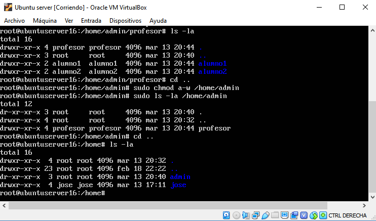
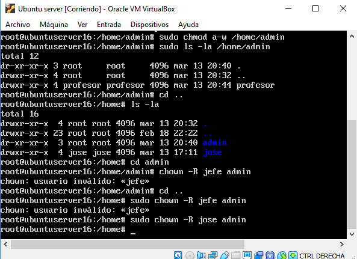
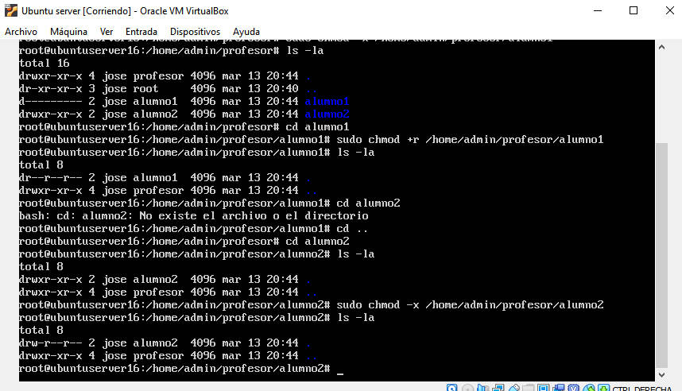
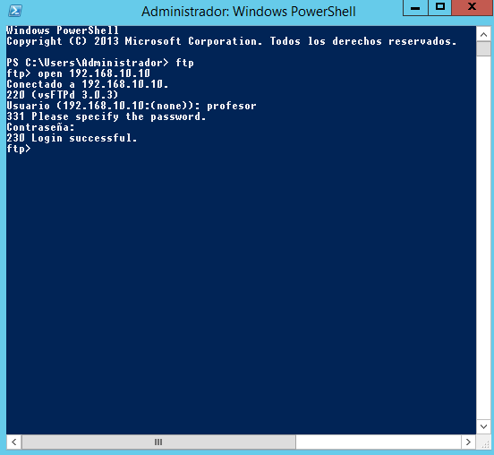

# Instalación y configuración de VSFTPD con usuarios aislados del sistema

## Introducción
Una de las grandes ventajas de Ubuntu, y en general de cualquier distribución Linux, es que puedes montar de forma muy 
sencilla diferentes servicios, y entre los servicios mas interesantes que podemos disfrutar en nuestra máquinas es un 
servicio ftp.

En el mundo de la informática en general, un servidor es un dispositivo que provee servicios a otros equipos, que se 
conocen como clientes. Y ¿qué es un servicio? Pues un servicio o demonio, es una aplicación o programa que se ejecuta 
en segundo plano, y cuya función mas habitual es la de ofrecer servicios a otros programas.

En este repositorio, veremos como instalar de forma muy sencilla un servicio FTP mediante VSFTPD. FTP es un protocolo
de transferencia de archivos y es el más utilizado en el mundo de internet.

## VSFTPD
He de decir primero, que el servidor vsftpd, se distribuye bajo licencia libre GNU GPL y puede descargarse de la 
página oficial de [vsftpd](https://security.appspot.com/vsftpd.html) .

Vsftpd (Very Secure FTP Daemon), es un servicio FTP que permite implementar servicios de archivos mediante protocolo FTP,
caracterizándose principalmente porque se trata de un sistema muy seguro, a la vez que muy sencillo de configurar. 
[Ver más información](https://en.wikipedia.org/wiki/Vsftpd)

## Actualización
Antes de comenzar nada se debe hacer una actualización del servidor para que no haya ningún error de 
compatibilidad. Para ello se puede utilizar el comando ***`sudo apt-get update`*** , e incluso a veces se aconseja realizar 
también una mejora del sistema utilizando ***`sudo apt-get upgrade`*** .

## Instalación
Una vez que hayamos actualizado el servidor procederemos a la instalación, para ello nos ayudaremos del comando 
***`sudo apt-get install vsftpd`*** .

Como reseña y antes de seguir avanzando es interesante conocer los comandos para iniciar, detener y reiniciar el 
servicio:
* Iniciar: ***`sudo service vsftpd start`***
* Detener: ***`sudo service vsftpd stop`***
* Reiniciar: ***`sudo service vsftpd restart`***

Ojo: ***service*** o ***systemctl*** según la versión del sistema operativo.

## Copia de seguridad
Para poder continuar con total tranquilidad, es recomendable realizar una copia de seguridad del archivo ***vsftpd.conf*** 
que posteriormente se configurará por si se hace mal la práctica. Para ello se utilizará el comando ***`sudo cp /etc/vsftpd.conf /etc/vsftpd.conf.original`*** .
Aquí le estamos diciendo que se haga una copia en ***/etc/vsftpd.conf.original*** .

## Configuración de VSFTPD
Una vez que vsftpd está instalado, se puede comenzar a configurar el servidor FTP. Este servicio por defecto tiene la sesión
anónima desactivada, además, viene sin los usuarios enjaulados, lo que significará que cualquier usuario que
inicie sesión se podrá mover por todos los directorios. Así que lo primero que haremos será activar el chroot o jaula 
de los usuarios, para ello utilizaremos ***`sudo nano /etc/vsftpd.conf`***

Una vez hemos realizado estos cambios, podemos guardar y salir. Seguidamente reiniciamos el servicio de vsftpd: 
***`sudo service vsftpd restart`*** . 

Si no nos dice nada el sistema es que se ha restablecido correctamente. No obstante es interesante comprobar el estado 
del servidor para verificar que el servicio esté funcionando correctamente. Para ello podemos utilizar el comando ***`sudo service vsftpd status`***

Con esto ya nos podríamos conectar desde el navegador poniendo en la barra de direcciones ftp://IP_servidor 

Para obtener la Ip podemos ayudarnos de ***`ifconfig`*** .

# Usuarios/Enjaular usuarios
Cuando se crea un servidor FTP de Ubuntu, habrá que tener en cuenta que hay que crear/seleccionar unos usuarios con sus 
correspondientes configuraciones para que puedan tener el acceso FTP.

Si los usuarios locales del servidor se conectan remotamente mediante un cliente ftp al servicio, podrán acceder a sus 
carpetas personales y además al resto del sistema de archivos. Esto es peligroso y un fallo de seguridad. Vamos a explicar
cómo limitarlos a su carpeta /home/usuario. Este proceso se le llama chroot (enjaular).

## Creación de usuarios
Para la creación de un nuevo usuario bastará con utilizar el comando ***`sudo adduser nombre_usuario`*** . Concretamente
en este tutorial utilizaremos como ejemplo la creación de un usuario profesor, alumno1 y alumno2. Nuevamente en este apartado
es interesante destacar la posibilidad de borrar usuarios ***`sudo deluser nombre_usuario`*** o de borrarlos junto con sus archivos.
***`sudo deluser --remove-home nombre_usuaruio`*** o ***`sudo userdel nombreusuario`*** .

En la siguiente imagen se puede observar la ejecución de los comandos anteriores, no obstante como ya se ha comentado al inicio
de este apartado se crearán de idéntica forma que en la imagen los usuarios alumno1 y alumno2.

## Creación de directorios
Cuando se crea un usuario el sistema pide ingresar una contraseña para ese usuario y completar todos los demás detalles. 
Lo ideal es que el FTP se restrinja a un directorio específico por motivos de seguridad. Vsftpd usa jaulas chroot para lograr esto. 
Con chroot habilitado, un usuario local está restringido a su directorio de inicio (por defecto). Sin embargo, es posible
que debido a la seguridad de vsftpd, un usuario no pueda escribir en el directorio. No eliminaremos los privilegios de 
escritura de la carpeta de inicio; en su lugar, crearemos un directorio ftp que actuará como chroot junto con un 
directorio de archivos modificables que será responsable de mantener los archivos pertinentes. 

Explicado esto hay que crear el árbol de directorios y el correspondiente a cada usuario. En el caso de esta práctica 
crearemos 4 directorios, uno para cada usuario y otro para admin. Meteré los 2 directorios de alumnos dentro del directorio 
de profesor y el de profesor dentro del de admin. 

Para ello utilizaré el comando ***`sudo mkdir /home/nombre_usuario`*** pero antes de nada todo el árbol de directorios
tendrá como raíz el directorio admin ***`sudo mkdir /home/admin`*** . Para realizar el árbol de directorios correctamente 
tendremos que borrar los directorios creados anteriormente (usuarios) para volver a crearlos de nuevo en dependencia de 
admin.

Usaré el comando ***rm*** pero es interesante tener en cuenta los siguientes aspectos. Si queremos eliminar una carpeta 
que ya esta vacía se puede emplear el siguiente comando ***`sudo rmdir nombre_carpeta`*** , pero sólo si esta vacía.

Si la carpeta contiene subcarpetas pero no archivos podremos emplear el siguiente comando ***`sudo rmdir -p nombre_carpeta`*** ,
recordando que solo funcionará si la carpeta tiene subcarpetas vacías.

Y por último el que nos sera de más utilidad, con ***`rm -R nombre_carpeta`*** podremos eliminar la carpeta con todos 
los elementos interiores, ya sean subcarpetas, archivos, etc.

***Eliminación de directorios/usuarios***

***Crear árbol de directorios***

A continuación asignaremos que los usuarios sean dueños de sus propios directorios/carpetas. Para ello utilizaremos 
***`sudo chown root:root nombredeusuario:nombredegrupo /home/directorio`***

## Asignar home
A continuación necesitamos especificar la carpeta home de un usuario para que sea el lugar en el que aparece al 
conectarnos mediante ftp (lo aislamos por arriba en su carpeta home). Para ello utilizaremos ***`sudo nano /etc/passwd`***

Aquí asignaremos la carpeta home (las carpetas anteriormente creadas) a los usuarios creados y tocaremos sus permisos.

    Importante reseñar aquí los datos de los usuarios donde el primer número en profesor por ejemplo corresponde a su 
    identifiación (1001) y el segundo (1002) a su grupo.
    
Un aspecto que hay que tener presente a continuación van a ser los permisos. En el caso de admin  debe ser de solo 
lectura (por seguridad), si no lo tenemos configurado así dará error. Cambiamos el modo de una carpeta con el comando chmod.
Por lo tanto eliminaremos los permisos de escritura con el comando ***`sudo chmod a-w /home/admin`*** 

Para verificar que los permisos estén correctamente podremos utilizar ***`sudo ls -la /home`***

## Propietarios
Si queremos cambiar el propietario de una carpeta y todo su contenido por otro propietario/usuario podríamos hacerlo con
el comando ***` chown -R nuevo_usuario nombre_carpeta`*** . En esta práctica cambiaremos el propietario de la carpeta de 
root a el usuario principal del sistema, en este caso jose.

## Permisos de carpetas
Como última modificación de esta práctica pondremos permisos a las carpetas creadas anteriormente. El objetivo es conseguir
que alumno1 solo pueda leer lo que hay en su carpeta pero que alumno2 pueda leer y escribir dentro de su carpeta.

## Conexión
Por último sólo quedaría comprobar que se establezca correctamente la conexión desde un cliente. Para ello en la terminal
del cliente en este caso Windows Server y con la ayuda del comando ***`ftp open direccionIP`*** tal como se aprecia en 
la imagen. El servicio pediría el usuario y contraseña y se vería si se ha logueado correctamente. 

 